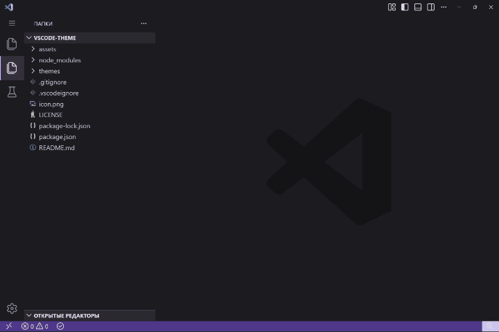

# Zairyo Themes — 20 Material You Themes for VS Code

**Author:** thejenja  
**Inspired by:** Material You color system

Transform your coding environment with Zairyo, a collection of 20 carefully crafted VS Code themes generated from a single accent color. Each theme adapts the Material You color token system into a cohesive, accessible palette.

---

## 🌍 5 Color Schemes

| Scheme                  | Preview                                        | Mood                |
| ----------------------- | ---------------------------------------------- | ------------------- |
| 🔮 **Zairyo** (Purple)  | Default base theme with elegant purple accents | Calm & focused      |
| 🌊 **Umi** (Blue)       | Cool ocean blues for clarity                   | Cool & refreshing   |
| 🌲 **Mori** (Green)     | Natural greens that ease eye strain            | Balanced & soothing |
| 🌅 **Yuuyake** (Orange) | Warm sunset oranges for energy                 | Warm & vibrant      |
| 🌹 **Bara** (Pink)      | Soft pinks for a gentle atmosphere             | Soft & elegant      |

---

## 🎨 4 Variants × 5 Schemes = 20 Themes

All themes follow consistent names:

```
Zairyo [Variant]
[Scheme Name] [Variant]
```

| Variant            | Usage                                 |
| ------------------ | ------------------------------------- |
| **Dark**           | Default dark mode                     |
| **Dark Contrast**  | High-contrast dark (visibility boost) |
| **Light**          | Default light mode                    |
| **Light Contrast** | High-contrast light                   |

### Complete Theme List

#### 🔮 Zairyo (Base — Purple)

- `Zairyo Dark`
- `Zairyo Dark Contrast`
- `Zairyo Light`
- `Zairyo Light Contrast`

#### 🌊 Umi (Sea — Blue)

- `Zairyo Umi Dark`
- `Zairyo Umi Dark Contrast`
- `Zairyo Umi Light`
- `Zairyo Umi Light Contrast`

#### 🌲 Mori (Forest — Green)

- `Zairyo Mori Dark`
- `Zairyo Mori Dark Contrast`
- `Zairyo Mori Light`
- `Zairyo Mori Light Contrast`

#### 🌅 Yuuyake (Sunset — Orange)

- `Zairyo Yuuyake Dark`
- `Zairyo Yuuyake Dark Contrast`
- `Zairyo Yuuyake Light`
- `Zairyo Yuuyake Light Contrast`

#### 🌹 Bara (Rose — Pink)

- `Zairyo Bara Dark`
- `Zairyo Bara Dark Contrast`
- `Zairyo Bara Light`
- `Zairyo Bara Light Contrast`

---

## 🚀 Installation

### From VSCode

1. Open **Extensions** (`Ctrl+Shift+X`)
2. Search for `zairyo-themes`
3. Click **Install**

### Manual

```bash
# Clone and symlink
git clone https://github.com/thejenja/zairyo-theme-vscode.git && cd zairyo-theme-vscode
vsce package
code --install-extension zairyo-themes-1.0.0.vsix
```

---

## 🎯 Usage

1. Open **Command Palette** (`Ctrl+Shift+P`)
2. Run `Preferences: Color Theme`
3. Select your preferred **Zairyo** variant

VS Code will remember your last used theme per color mode (dark/light).

---

## 🎬 Theme Preview



## 📦 Publishing & VSIX

```bash
# Package
vsce package

# Install locally
code --install-extension zairyo-themes-1.0.0.vsix

# Publish
vsce publish
```

---

## 📂 Project Structure

```
.
├── package.json            # Extension manifest (icon + themes)
├── themes/                 # 20 generated .json files
├── icon.png                # 128×128px extension icon
└── README.md               # This file
```

---

## 💡 Tips

| Goal                   | Theme                   |
| ---------------------- | ----------------------- |
| Low light / evening    | `Zairyo Dark`           |
| Daylight / bright room | `Zairyo Light`          |
| Sunlight / outdoors    | `Zairyo Light Contrast` |
| Max visibility         | `Zairyo Dark Contrast`  |
| Fresh & cool           | `Zairyo Umi Dark`       |
| Natural & soft         | `Zairyo Mori Light`     |
| Cozy & warm            | `Zairyo Yuuyake Dark`   |
| Gentle & pastel        | `Zairyo Bara Light`     |

---

## 🌠 Credits

Made with Japanese precision by **thejenja**  
Material You color system by Google

Light & dark variants adapt automatically to system preference. Contrast variants require manual selection.

---

_Happy coding with Zairyo! ✨_
